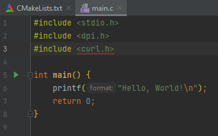

# Notes about CMAKE

### Toggle Makefile verbosity

	set(CMAKE_VERBOSE_MAKEFILE off)

### Compile with DEGUG support

    set(CMAKE_BUILD_TYPE Debug)

### Tell the linker to use static libraries

	set(CMAKE_LINK_SEARCH_START_STATIC on)

### The path to the top level of the build tree

	${CMAKE_BINARY_DIR}

### Print an informative message

	message("message to print")

### Print en error message and exit

	message(FATAL_ERROR "error message")

### Configure the search path for the header files

	include_directories(/path/to/includes1 /path/to/includes1 ...)

### Configure the search path for the libraries

	link_directories(/path/to/libraries1 /path/to/libraries2 ...)

### Add -D define flags to the compilation of source files

	add_definitions(-DDEF1 -DDEF2 ...) 

### Set compiler flags

    set(C_FLAGS "-Wall -Wuninitialized -Wmissing-include-dirs -Wextra -Wconversion -Werror -Wfatal-errors -Wformat")

### Test the operating system

	message("os:  ${CMAKE_SYSTEM}")
	if (CMAKE_SYSTEM MATCHES "Linux.*")
		...
	elseif(CMAKE_SYSTEM MATCHES "Darwin.*")
		...
	else()
	    message( FATAL_ERROR "Unsupported OS ${CMAKE_SYSTEM}" )
	endif()

### Test the presence of headers and libraries

#### Test the presence of a header files

Here, we look for the ChilKat header files:

	include(CheckIncludeFiles)

	...

	set(CMAKE_REQUIRED_INCLUDES $ENV{CHILKAT_INCLUDE_PATH})
	CHECK_INCLUDE_FILES("wchar.h;C_CkByteData.h;C_CkPrivateKey.h;C_CkString.h;C_CkCert.h;C_CkCrypt2.h;C_CkStringArray.h;C_CkBinData.h" HEADERS_CHILKAT LANGUAGE C)
	if(NOT HEADERS_CHILKAT)
	    message(FATAL_ERROR "Chilkat header files not found. Please configure CHILKAT_INCLUDE_PATH.")
	else()
	    message("OK: ChilKat header files found")
	endif()

In case you have trouble:

	rm CMakeCache.txt
	cmake --debug-trycompile .
	cat CMakeFiles/CMakeError.log 

Another way to perform the test _on a single file_:

	message("Path to ODPI-C headers (ODPIC_INCLUDE_PATH): $ENV{ODPIC_INCLUDE_PATH} (path not necessarily used)")
	message("Try to find the header file <dip.h> without using the environment variable ODPIC_INCLUDE_PATH")
	find_path(DIR_HEADER_ODPIC dpi.h)
	if(NOT DIR_HEADER_ODPIC)
	    message("WARNING: ODPI-C header files not found. Please configure the environment variable ODPIC_INCLUDE_PATH.")
	    if(DEFINED ENV{ODPIC_INCLUDE_PATH})
	        message("ODPIC_INCLUDE_PATH is defined ($ENV{ODPIC_INCLUDE_PATH})")
	        include_directories($ENV{ODPIC_INCLUDE_PATH})
	    else()
	        message(FATAL_ERROR "ODPIC_INCLUDE_PATH is not defined. The build cannot be done.")
	    endif()
	else()
	    message("OK: ODPI-C header files found (in directory ${DIR_HEADER_ODPIC})")
	endif()

> Here, we use the function `find_path` instead of `CHECK_INCLUDE_FILES`. And we start by looking for the file without using the path that is given by the environment variable. If we can't find it, then we set the path that has been configured within the environment variable (and hope that this path will help).

#### Test the presence of libraries

Here, we look for the library `libchilkat-9.5.0.a`:

	find_library(LIB_CHILKAT chilkat-9.5.0 HINTS ENV CHILKAT_LIBRARY_PATH)
	if(NOT LIB_CHILKAT)
	    message(FATAL_ERROR "Chilkat library not found. Please configure CHILKAT_LIBRARY_PATH.")
	else()
	    message("OK: ChilKat library found")
	endif()

In case you have trouble:

	rm CMakeCache.txt
	cmake --debug-trycompile .
	cat CMakeFiles/CMakeError.log 

Another way to perform the test:

	message("Path to ODPI-C library (ODPIC_LIBRARY_PATH): $ENV{ODPIC_LIBRARY_PATH} (path not necessarily used)")
	message("Try to find the library <odpic> without using the environment variable ODPIC_LIBRARY_PATH")
	find_library(DIR_LIB_ODPIC odpic)
	if(NOT DIR_LIB_ODPIC)
	    message("WARNING: ODPI-C library not found. Please configure the environment variable ODPIC_LIBRARY_PATH.")
	    if(DEFINED ENV{ODPIC_LIBRARY_PATH})
	        message("ODPIC_LIBRARY_PATH is defined ($ENV{ODPIC_LIBRARY_PATH})")
	        link_directories($ENV{ODPIC_LIBRARY_PATH})
	    else()
	        message(FATAL_ERROR "ODPIC_LIBRARY_PATH is not defined. The build cannot be done.")
	    endif()
	else()
	    message("OK: ODPI-C library found (file ${DIR_LIB_ODPIC})")
	endif()

> Here, we start looking for the library without using the environment variable (that should give the path to the directory that contains the library). If we can't find it, then we set the path that has been configured within the environment variable (and hope that this path will help).

### Declare a target static library

	add_library(nameA STATIC sourceA1 sourceA2 ...) # => libnameA.a
	add_library(nameB STATIC sourceB1 sourceB2 ...) # => libnameB.a

	set(TARGETS nameA nameB)

	set_target_properties(
	        ${TARGETS}
	        PROPERTIES
	        COMPILE_FLAGS -Wall
	        ARCHIVE_OUTPUT_DIRECTORY lib
	        EXCLUDE_FROM_ALL off
	        DEPENDS other_target)

> This will build 2 static libraries `lib/libnameA.a` and `lib/libnameB.a`.
>
> Please note the use of the property `ARCHIVE_OUTPUT_DIRECTORY`.

* `COMPILE_FLAGS`: add flags for the compilation.
* `ARCHIVE_OUTPUT_DIRECTORY`: specify the path to the directory where to create the targets (`libnameA.a`, `libnameB.a`).
* `EXCLUDE_FROM_ALL`: tell whether the target must be compiled when building _all_, or not.
* `DEPENDS`: specify a dependency. The target `other_target` is required to build the listed targets (`libnameA.a` and `libnameB.a`).

### Create a static library with relocatable code

You have to set the property `POSITION_INDEPENDENT_CODE`. For example:

    add_library(string STATIC src/lib/libstring.c src/lib/libstring.h)
    set_target_properties(
            string
            PROPERTIES
            COMPILE_FLAGS -Wall
            POSITION_INDEPENDENT_CODE ON
            ARCHIVE_OUTPUT_DIRECTORY lib
            EXCLUDE_FROM_ALL off)

> This is equivalent to the option `-fPic`.

### Create a shared library

Use the keyword `SHARED`. For example:

    add_library(parser001 SHARED src/lib/parsers/parser001.c src/lib/parsers/parser.h)
    add_dependencies(parser001 string)
    target_link_libraries(parser001 string pcre2-8)
    set_target_properties(
            parser001
            PROPERTIES
            COMPILE_FLAGS -Wall
            POSITION_INDEPENDENT_CODE ON
            LIBRARY_OUTPUT_DIRECTORY parsers
            EXCLUDE_FROM_ALL off)

### Declare a target executable

	# Some dependencies...
	add_library(dependency1 STATIC ...) # => libdependency1.a
	add_library(dependency2 STATIC ...) # => libdependency2.a
	add_library(dependency3 STATIC ...) # => libdependency3.a

	...

	# Declare executables
	add_executable(executableA sourceA1 sourceA2 ...)
	add_dependencies(executableA dependency1 dependency2)
	target_link_libraries(executableA
        curl
        dependency1
        dependency2)

	add_executable(executableB sourceB1 sourceB2 ...)
	add_dependencies(executableB dependency1)
	target_link_libraries(executableB
		zmq
		dependency1)

	set(TEST_EXE executableA executableB)

	set_target_properties(
	        ${TEST_EXE}
	        PROPERTIES
	        COMPILE_FLAGS  -Wall
	        RUNTIME_OUTPUT_DIRECTORY bin
	        EXCLUDE_FROM_ALL off
	        DEPENDS dependency3)

> This will build two executables: `bin/executableA` and `bin/executableB`).

* `COMPILE_FLAGS`: add flags for the compilation.
* `RUNTIME_OUTPUT_DIRECTORY`: specify the path to the directory where to create the targets (`executableA`, `executableB`).
* `EXCLUDE_FROM_ALL`: tell whether the target must be compiled when building _all_, or not.
* `DEPENDS`: specify a dependency. The target `dependency3` is required to build the listed targets (`executableA` and `executableB`).

### Define the "test" rule

	enable_testing()

	set(LOCAL_TESTS_SCRIPTS_DIRECTORY "${CMAKE_BINARY_DIR}/tests/script")
	set(LOCAL_TESTS_BIN_DIRECTORY "${CMAKE_BINARY_DIR}/tests/bin")

	...

	# Build the programs that implement the tests
	add_executable(test_program1 ...)
	add_executable(test_program2 ...)

	...

	# Create the list of programs to execute in order to run the tests suite.
	add_test(test_init      ${LOCAL_TESTS_SCRIPTS_DIRECTORY}/unit-tests-init.sh)
	add_test(test_program1  ${LOCAL_TESTS_BIN_DIRECTORY}/test_program1)
	add_test(test_program2  ${LOCAL_TESTS_BIN_DIRECTORY}/test_program2)
	add_test(test_terminate ${LOCAL_TESTS_SCRIPTS_DIRECTORY}/unit-tests-terminate.sh)

And, you may want to set environment variables for the tests:

	set_tests_properties(
	        test_init test_program1 test_program2 test_terminate
	        PROPERTIES
	        ENVIRONMENT "REPORT_DIR=${LOCAL_TESTS_REPORT_DIRECTORY};DATA_DIR=${LOCAL_TESTS_DATA_DIRECTORY};WORKBENCH_DIR=${LOCAL_TESTS_WORKBENCH_DIR_DIRECTORY}")

To execute the tests from the command line:

	cmake . && make && make test

or:

	ctest [--verbose]

### Customize the "clean" rule

	set_directory_properties(PROPERTIES
        ADDITIONAL_MAKE_CLEAN_FILES "tests/bin/*;lib/*.a;bin/*")

### Add a custom target / rule

	add_custom_target(doc
		COMMAND bash -c "rm -rf doc/*"
		COMMAND bash -c "doxygen")

### Create a source file at build time

Scenario: you want to insert the date of the compilation into the executable you are building.

One solution is to produce a header file that defines a constant which represents the date.
For example, we can think of the header file `src/data.h`:

    #ifndef DATE
    #define DATE "2020-6-11 10:11:22"
    #endif

This header file gets included in all executables sources. And these codes use the constant `DATE`.

To produce the header `src/date.h` we use a programme.
For example, we can think of the program `src/date.c`:

    #include <stdio.h>
    #include <time.h>
    
    int main(int argc, char *argv[])
    {
        if (2 != argc) {
            printf("Usage: %s <output file>\n", argv[0]);
            return 1;
        }
    
        time_t t = time(NULL);
        struct tm tm = *localtime(&t);
    
        FILE *fd = fopen(argv[1], "w");
        if (NULL == fd) {
            fprintf(stderr, "Cannot open the file <%s> for writing.\n", argv[1]);
            return 1;
        }
        fprintf(fd, "#ifndef DATE\n");
        fprintf(fd,"#define DATE \"%d-%02d-%02d %02d:%02d:%02d\"\n", tm.tm_year + 1900, tm.tm_mon + 1, tm.tm_mday, tm.tm_hour, tm.tm_min, tm.tm_sec);
        fprintf(fd, "#endif\n");
        fclose(fd);
        return 0;
    }

So, we need to:

* Compile `src/data.c` into `bin/date.exe`.
* Run `bin/date.exe src/date.h`.
* Compile all the executables that include `date.h`.

Declare the target `data.exe`. This will produce `date.exe` from `src/data.c`.

    add_executable(date.exe src/date.c)
    set_target_properties(
            date.exe
            PROPERTIES
            RUNTIME_OUTPUT_DIRECTORY bin)

Define a target name "date" (cmake <target>) that only runs the command that creates the header file `src/date.h`.

    add_custom_target(date
            COMMAND bin/date.exe src/date.h
            COMMENT "Create the header file 'src/date.h'"
    )
    add_dependencies(date date.exe) # Compile "src/date.c", if necessary.
    
> Please note that the recipe for target `date` is executed **unconditionally**
> (whenever CMAKE encounters a target that depends on it).
    
Add a target for an executable. 

    add_executable(the_executable.exe
            src/source1.c
            src/source2.c
            src/date.h)

> Please note that the executable depends on `src/date.h`. This dependency is important
> for two reasons:
> * you want the executable to be (re)compiled whenever the file `src/date.h` changes.
>   And keep in mind that `src/date.h` is regenerated **unconditionally** upon all CMAKE execution.
> * you must add the dependency `src/date.h` if you want CLion to know about this file. 

You want the file `src/date.h` to be **unconditionally** (re)generated (even if it already exists).

    add_dependencies(the_executable.exe date)
    
> `the_executable.exe` depends on `date`.
> `date` recipe is executed unconditionally
> => `src/date.h` is (re)generated unconditionally
> => `the_executable.exe` is (re)generated unconditionally

# ANNEXE

### Get the compiler list of search paths for headers and libraries

```bash
echo | gcc -E -Wp,-v - | grep -v "# "
```
* -E: Stop after the preprocessing stage; do not run the compiler proper. The output is in the form of preprocessed source code, which is sent to the standard output. Input files which don't require preprocessing are ignored.
* -Wp: You can use `-Wp,option` to bypass the compiler driver and pass option directly through to the preprocessor. 

### CLION troubleshooting while using the remote mode

#### Header file not found

You may experience the following problem while using CLION in remote mode.

* CMAKE is well configured.
* The project compiles.
* But within the CLION editor, a header file cannot be found.

The reason for this error is that CLION did not upload the missing header file from the Docker container.
You need to synchronise the local copy of the build environment with the one on the container.



> In the screenshot above, CLION cannot find the header file "`curl.h`".

In this case, you probably need to "resync with remote hosts".

`Tools` => `Resync with remote hosts`

See this document: [Resync header search paths](https://www.jetbrains.com/help/clion/remote-projects-support.html#resync)

#### You changed the CMAKE specification file (CMakeLists.txt), but "nothing happens"

You need to reload the CMake project: `Tools` => `CMake` => `Reload CMake Project`

#### You did everything described above, but the problem persists

You may need to reset the cache and reload the CMake project: `Tools` => `CMake` => `Reset Cache and Reload Project`

### Good links

* [CMake FAQ](https://gitlab.kitware.com/cmake/community/-/wikis/FAQ)
